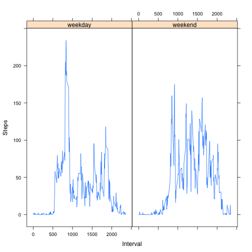

## Reproducible research Project 1

by Vladimir Zaytsev

## 1. Code for reading in the dataset and/or processing the data

```r
unzip("activity.zip", exdir = "." )
fdata <- read.csv("activity.csv")
fdata$date <- as.Date (fdata$date)
fdata$steps <- as.numeric(fdata$steps)
fdata$interval<- as.numeric(fdata$interval)
data <- fdata[complete.cases(fdata), ]
```


## 2. Histogram of the total number of steps taken each day


```r
library(ggplot2)
ggplot(data, aes(date, steps))+ geom_bar(stat = "identity") + labs(x = "Dates", y = "Steps")
```

 

## 3. Mean and median number of steps taken each day

```r
saggdata <- aggregate(data$steps, list(date = data$date), FUN = "sum")
```
Mean:

```r
mean(saggdata$x, na.rm = TRUE)
```

```
## [1] 10766.19
```
Median:

```r
median(saggdata$x, na.rm = TRUE)
```

```
## [1] 10765
```


##4. Time series plot of the average number of steps taken

```r
maggdata <- aggregate(data$steps, list(date = data$date), FUN = "mean")
ggplot(maggdata, aes(date, x))+ geom_line(stat = "identity") + labs(x = "Dates", y = "Steps")
```

 

#5. The 5-minute interval that, on average, contains the maximum number of steps


```r
maggdata[maggdata$x == max(maggdata$x, na.rm = TRUE), ]
```

```
##          date        x
## 47 2012-11-23 73.59028
```

##6. Code to describe and show a strategy for imputing missing data


```r
length(fdata[is.na(fdata),]$date)
```

```
## [1] 2304
```

Let's zero missing data:


```r
fdata[is.na(fdata),]$steps <- 0
```

##7. Histogram of the total number of steps taken each day after missing values are imputed

```r
ggplot(fdata, aes(date, steps))+ geom_bar(stat = "identity") + labs(x = "Dates", y = "Steps")
```

 

```r
saggfdata <- aggregate(fdata$steps, list(date = fdata$date), FUN = "sum")
```
Mean is different:

```r
mean(saggfdata$x, na.rm = TRUE)
```

```
## [1] 9354.23
```
Median is different:

```r
median(saggfdata$x, na.rm = TRUE)
```

```
## [1] 10395
```

##8. Panel plot comparing the average number of steps taken per 5-minute interval across weekdays and weekends

Assign weekdays and calculate average:


```r
data$day <- factor(weekdays(data$date))
levels(data$day) <- list(weekday = c("Monday", "Tuesday", "Wednesday", "Thursday", "Friday"),
                                 weekend = c("Saturday", "Sunday"))
aggdata <- aggregate(data$steps, list(interval = data$interval, days = data$day), FUN = "mean")
```

Plot side-by-side:


```r
library(lattice)
xyplot(aggdata$x ~ aggdata$interval | aggdata$days, type="l", 
       xlab = "Interval", ylab = "Steps")
```

 

